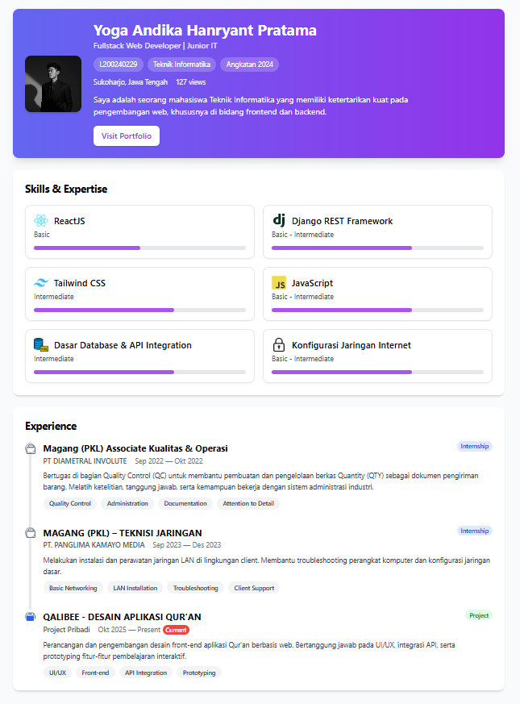

# Deskripsi Aplikasi

Aplikasi ini merupakan Single Page Application (SPA) yang dibangun menggunakan ReactJS (Vite) dan Tailwind CSS. Aplikasi berfungsi sebagai tampilan CV/portofolio digital mahasiswa yang menampilkan:

    1. Profile – informasi mahasiswa, foto, NIM, prodi, angkatan, lokasi, deskripsi singkat.

    2. Skills – daftar kemampuan teknis lengkap dengan ikon, level, dan pengalaman.

    3. Experiences – pengalaman kerja/magang/organisasi dalam bentuk timeline.

Seluruh data mahasiswa disimpan di file terpisah, yaitu dataMahasiswa.json, dan dibaca secara otomatis, bukan hardcoded di dalam komponen untuk memenuhi ketentuan tugas.

Aplikasi ini didesain modern, responsif, dan mudah dikembangkan dengan struktur komponen modular.

# Cara Menjalankan Proyek

persyaratan:

    - Node.js versi 16+
    - NPM bawaan Node

Perintah untuk Menjalankan aplikasi

    1. Buka terminal pada folder project
    2. npm install
    3. npm run dev
    4. Buka browser dan akses:
    http://localhost:5173

# Link deployment
    
    https://yogaandika-cv.netlify.app/

# Screenshot tampilan

